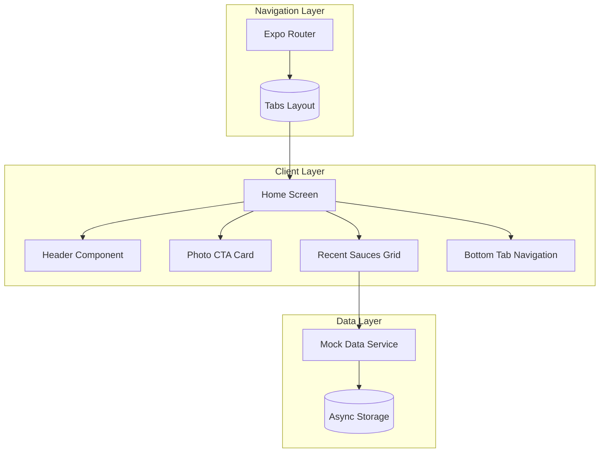
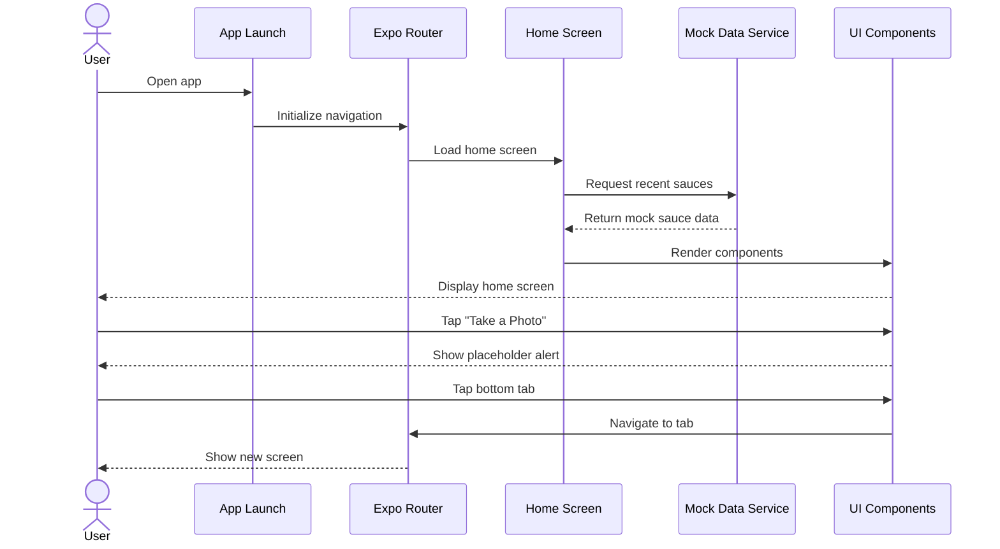
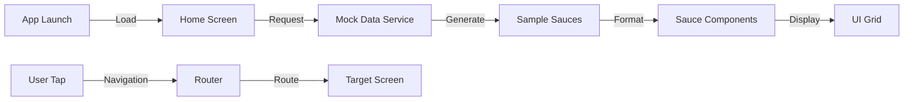

# Design Specification

## Architecture Overview

**Feature:** Home Screen
**Architecture Pattern:** Component-based with Expo Router navigation

## MVP Design Constraints ✅

- **Database:** No database needed for MVP (mock data only)
- **API:** Mock data service for recent sauces
- **UI:** 4 core components (Header, CTA Card, Sauce Grid, Tab Bar)
- **No Features:** No actual camera, no backend API, no authentication, no real data persistence

## System Architecture

### High-Level Architecture



### Key User Flow - View Home Screen



### Data Flow



## Components

### Component 1: HomeScreen

**Purpose:** Main container for home screen layout
**Location:** `app/(tabs)/index.tsx`
**Dependencies:** React Native components, custom components, mock data service

#### Interface

```typescript
interface HomeScreenProps {
  // No props needed for MVP
}

// Main component export
export default function HomeScreen(): React.JSX.Element;
```

#### Responsibilities

- Compose header, CTA card, and sauce grid components
- Manage screen layout with ScrollView
- Handle safe area insets
- Coordinate data fetching from mock service

### Component 2: Header

**Purpose:** Display app branding and profile button
**Location:** `app/components/home/Header.tsx`
**Dependencies:** React Native components, Expo vector icons

#### Interface

```typescript
interface HeaderProps {
  onProfilePress: () => void;
}

export function Header({ onProfilePress }: HeaderProps): React.JSX.Element;
```

#### Responsibilities

- Display "HotSauce AI" title with flame icon
- Show profile button in top right
- Handle safe area top inset
- Maintain consistent styling

### Component 3: PhotoCTACard

**Purpose:** Prominent call-to-action for photo capture
**Location:** `app/components/home/PhotoCTACard.tsx`
**Dependencies:** React Native components, Expo vector icons

#### Interface

```typescript
interface PhotoCTACardProps {
  onPress: () => void;
  onUploadPress: () => void;
}

export function PhotoCTACard({ onPress, onUploadPress }: PhotoCTACardProps): React.JSX.Element;
```

#### Responsibilities

- Display large tappable card with camera icon
- Show "Take a Photo" text prominently
- Include "Upload from gallery" link below
- Handle press events with visual feedback

### Component 4: RecentSaucesGrid

**Purpose:** Display grid of recently scanned sauces
**Location:** `app/components/home/RecentSaucesGrid.tsx`
**Dependencies:** React Native components, mock data service

#### Interface

```typescript
interface Sauce {
  id: string;
  name: string;
  imageUrl: string;
  heatLevel: number; // 1-5
  scannedAt: Date;
}

interface RecentSaucesGridProps {
  sauces: Sauce[];
  onSaucePress: (sauce: Sauce) => void;
}

export function RecentSaucesGrid({
  sauces,
  onSaucePress,
}: RecentSaucesGridProps): React.JSX.Element;
```

#### Responsibilities

- Display sauce cards in 2-column grid layout
- Show empty state when no sauces
- Render sauce thumbnails with lazy loading
- Display heat level with flame icons

### Component 5: SauceCard

**Purpose:** Individual sauce display card
**Location:** `app/components/home/SauceCard.tsx`
**Dependencies:** React Native components, Expo Image

#### Interface

```typescript
interface SauceCardProps {
  sauce: Sauce;
  onPress: () => void;
}

export function SauceCard({ sauce, onPress }: SauceCardProps): React.JSX.Element;
```

#### Responsibilities

- Display sauce image thumbnail
- Show sauce name with ellipsis for long names
- Render heat level as 1-5 flame icons
- Handle press with visual feedback

## Data Models

### Model 1: Sauce

```typescript
interface Sauce {
  id: string;
  name: string;
  imageUrl: string;
  heatLevel: number; // 1-5 scale
  brand?: string;
  scannedAt: Date;
}
```

**Validation Rules:**

- Heat level must be integer between 1 and 5
- Name must be non-empty string
- ImageUrl must be valid URI or placeholder image path

### Model 2: TabRoute

```typescript
type TabRoute = "home" | "recipes" | "profile";

interface TabConfig {
  name: TabRoute;
  title: string;
  icon: string; // Icon name from vector icons
  isFAB?: boolean; // For special FAB-style tab
}
```

## API Design

### Mock Data Service

```typescript
// Mock service for MVP - will be replaced with real API
interface MockDataService {
  getRecentSauces(): Promise<Sauce[]>;
  addMockSauce(sauce: Omit<Sauce, "id">): Promise<Sauce>;
  clearSauces(): Promise<void>;
}
```

**Mock Response:**

```json
{
  "sauces": [
    {
      "id": "1",
      "name": "Sriracha Hot Chili Sauce",
      "imageUrl": "https://picsum.photos/200/300?random=1",
      "heatLevel": 3,
      "brand": "Huy Fong",
      "scannedAt": "2025-10-25T10:00:00Z"
    }
  ]
}
```

## Technology Decisions

### Frontend

- **Framework:** React Native with Expo SDK 54
- **Navigation:** Expo Router v6 (file-based routing)
- **State Management:** React hooks (useState, useEffect)
- **Styling:** StyleSheet with theme constants
- **Icons:** @expo/vector-icons (Ionicons, MaterialIcons)
- **Images:** expo-image for optimized image loading

### Component Library

- **Primary Choice:** Build custom components with React Native primitives
- **Rationale:** Simple UI needs, full control over styling, no external dependencies
- **Future Option:** Can add NativeBase or Tamagui if complexity grows

### Data Layer (MVP)

- **Storage:** AsyncStorage for mock data persistence
- **Data Fetching:** Simple async functions with mock delays
- **State:** Local component state (no global state needed for MVP)

## Security Considerations

- No sensitive data in MVP (all mock data)
- No authentication required for MVP
- Follow React Native security best practices
- Sanitize any user input in future iterations

## Performance Requirements

- Screen render < 500ms on mid-range devices
- Smooth 60fps scrolling with 10 sauce items
- Lazy load images with expo-image
- Use React.memo for expensive components
- Implement FlatList for sauce grid (virtualized list)

## Integration Points

- Expo Router for navigation between tabs
- AsyncStorage for mock data persistence
- Placeholder alerts for unimplemented features
- System settings for dark/light mode detection

## Error Handling Strategy

- Try-catch blocks for async operations
- Fallback UI for failed image loads
- Empty state for no sauces
- User-friendly error messages in alerts
- Console warnings for development debugging

## Testing Strategy

### E2E Testing Approach

**Philosophy:** Test real user flows with minimal mocking

**Test Stack:**

- **Jest:** Unit tests for utilities and components
- **React Native Testing Library:** Component testing
- **Detox or Maestro:** E2E testing on simulators (future)

**Test Coverage:**

- **Happy Path**: Launch app → View home → Tap CTA → See alert → Navigate tabs
- **Empty State**: Launch with no sauces → See empty message
- **Data Display**: Launch with mock sauces → Verify grid display
- **Navigation**: Tap each tab → Verify navigation works

**Test Data Management:**

- Mock data defined in `__tests__/fixtures/sauces.json`
- Reset AsyncStorage before each test
- Use consistent seed data for predictable tests

## File Structure

```
app/
├── (tabs)/
│   ├── _layout.tsx        # Tab navigator configuration
│   ├── index.tsx          # Home screen (main file)
│   ├── recipes.tsx        # Recipes placeholder
│   └── profile.tsx        # Profile placeholder
├── components/
│   └── home/
│       ├── Header.tsx
│       ├── PhotoCTACard.tsx
│       ├── RecentSaucesGrid.tsx
│       ├── SauceCard.tsx
│       └── EmptyState.tsx
├── constants/
│   └── theme.ts           # Colors, spacing, typography
├── services/
│   └── mockData.ts        # Mock data service
└── types/
    └── sauce.ts           # TypeScript interfaces
```

## Implementation Notes

- Use TypeScript strict mode for all components
- Follow React Native accessibility guidelines
- Implement haptic feedback for button presses (iOS)
- Support both iOS and Android platform differences
- Prepare for future API integration with service abstraction
